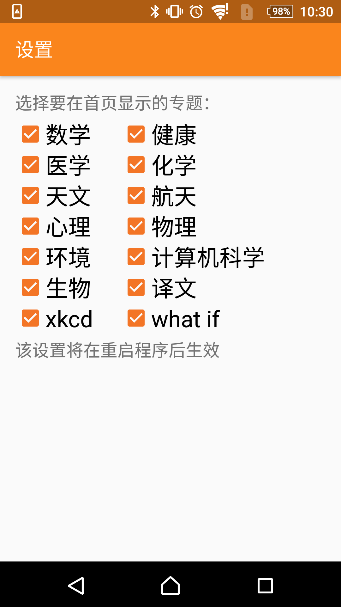

# Android_Songshuhui

第三方科学松鼠会Android客户端

科学松鼠会（Songshuhui-Association of Science Communicators）是一个致力于在大众文化层面传播科学的非营利机构 ，成立于2008年4月。松鼠会汇聚了当代最优秀的一批华语青年科学传播者，旨在“剥开科学的坚果，帮助人们领略科学之美妙”。《南方周末》评价说：“松鼠会的文字作品兼具科学精神和人文精神，已经成为本土科普作品的重要来源。”

愿景：让科学流行起来

价值观：严谨有容，独立客观

科学松鼠会主页：http://songshuhui.net

主界面

文章

设置页面

关于

